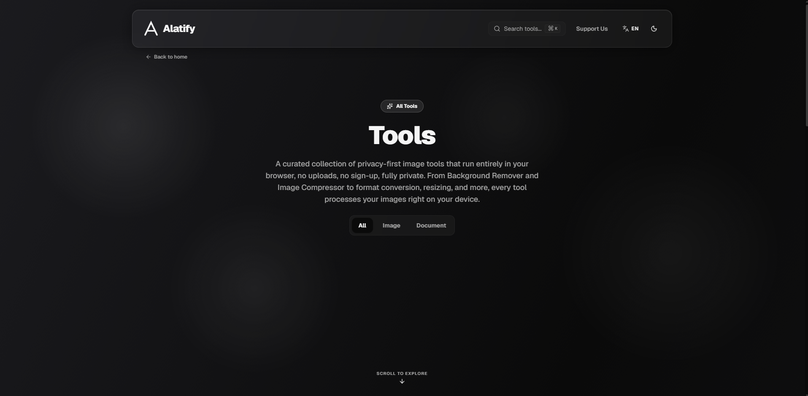

# Alatify

**Privacy-first file and image tools that run entirely in your browser.**

[getalatify.com](https://getalatify.com)

Your files never leave your device. Not "encrypted in transit." Not "deleted after one hour." They are never uploaded in the first place, because every tool runs as JavaScript and WebAssembly inside your own browser tab.

You do not have to take that on faith. Open DevTools, switch to the Network tab, and process a file. Nothing goes out.

Or skip DevTools entirely: **turn off your WiFi and most of the tools keep working.**


---

## Why this exists

Search for "free online image compressor" and every result does the same thing. It uploads your file to a server you know nothing about, processes it there, and hands you a download link. Your holiday photos, your ID scans, your signed contracts, all sitting on someone else's disk under a privacy policy nobody reads.

Browsers can do this work now. Canvas, WebAssembly, WebGPU, and Web Workers are fast enough that the round trip to a server is pure overhead. It exists to make the business model work, not to make the tool work.

Alatify is the argument that the upload step should not exist.

---

## Tools

**Images**

| Tool | What it does |
|---|---|
| AI Background Remover | Removes backgrounds with ISNet running on WebGPU, with a CPU fallback |
| Image Compressor | Lossy and lossless compression, with a dedicated PNG engine |
| Image Resizer | Resize by pixels or percentage, aspect ratio locking |
| Image Cropper | Free and fixed-ratio cropping |
| Format Converter | Convert between JPG, PNG, WebP, AVIF, and more |
| AI Upscaler | Real-ESRGAN super-resolution, 2x and 4x |
| Watermark | Text or logo, grid, free placement, or tiled, with batch export |
| Stock Image Finder | Search Unsplash, Pexels, and Pixabay for photos, illustrations, and vectors |

**Privacy**

| Tool | What it does |
|---|---|
| EXIF Cleaner | Strips metadata, including embedded GPS coordinates |
| Blur & Redact | Manual or automatic face blurring, baked irreversibly into the exported pixels |
| ID Protector | Redact ID cards and documents, with per-region blur strength |
| Steganography | Hide and recover messages inside PNG images |

**Documents**

| Tool | What it does |
|---|---|
| Markdown to PDF | Real selectable text output, not a rasterized screenshot |
| PDF to Markdown | Text extraction with adaptive paragraph detection |
| PDF Pages | Reorder, rotate, delete, split, and merge pages |
| PDF to Image | Render pages to PNG or JPG |
| Image to PDF | Combine multiple images into one document |

**Developer**

| Tool | What it does |
|---|---|
| QR Toolkit | Generate and scan QR codes, including WiFi and vCard payloads |
| HTML to Markdown | Paste or upload HTML, get clean Markdown |
| Code to Image | Syntax-highlighted code screenshots via Shiki |

Every tool ships in both English and Indonesian.

---

## What actually touches the network

Being loud about privacy means being precise about the exceptions. There are three, and none of them involve uploading your files.

**AI models download once.** The Background Remover, the AI Upscaler, and the automatic face detection in Blur & Redact each fetch a model file from a CDN the first time you use them. The models range from roughly 45 MB to 170 MB. After that first download they are cached by the browser and the tool runs fully offline. Your image is never part of that request.

**Stock Image Finder calls external APIs.** Searching for stock photos means querying Unsplash, Pexels, and Pixabay. Those queries are proxied through a server route so the API keys stay server-side. Your search terms leave your device. No file of yours does. This is the one tool where the "nothing leaves your device" claim does not apply, and it does not carry that badge in the UI.

**The app itself is served over the network.** Alatify is hosted on Vercel, which keeps standard request logs like any web host. Loading the page is a network request. Using the tools is not.

Everything else, all twenty tools in normal operation, makes zero network requests. That is the claim the WiFi test verifies.

---

## How it works

There is no backend that touches your files. There is no upload endpoint. The architecture is deliberately boring:

- **Canvas and `createImageBitmap`** for decoding, resizing, cropping, and compositing.
- **WebAssembly** for the work JavaScript is too slow at: `oxipng` for lossless PNG, `UPNG.js` for lossy PNG palette quantization.
- **ONNX Runtime Web** for the AI models, on WebGPU where available and CPU where not.
- **Web Workers** for anything that would otherwise freeze the tab, so the main thread stays responsive during heavy work.
- **Three API routes**, and only three: stock image search, the Unsplash download-trigger required by their API terms, and a connectivity probe. None of them accept a file.

Redactions and blurs are composited into the exported pixels, never applied as a CSS or DOM layer that could be peeled back. Exports are always at the source image's full resolution.

The app is also a PWA, so you can install it and open it without a connection.

---

## Tech stack

Next.js 14 (App Router), React 18, TypeScript, Tailwind CSS, shadcn/ui, Geist and Geist Mono. Deployed on Vercel.

Notable libraries: `onnxruntime-web`, `@imgly/background-removal`, `pdfjs-dist`, `pdf-lib`, `jsPDF`, `pdfmake`, `turndown`, `UPNG.js`, `@jsquash/oxipng`, `Shiki`, `exifr`, `@mediapipe/tasks-vision`.

---

## Running locally

Requires Node 20 or newer. Node 24 is what this is developed against.

```bash
git clone https://github.com/getalatify/AlatifyWeb.git
cd AlatifyWeb
npm install
npm run dev
```

Open <http://localhost:3000>.

Nineteen of the twenty tools work with no configuration at all. Only Stock Image Finder needs API keys. Copy `.env.example` to `.env.local` and fill in the ones you want:

```bash
cp .env.example .env.local
```

Free keys are available from [Unsplash](https://unsplash.com/developers), [Pexels](https://www.pexels.com/api/), and [Pixabay](https://pixabay.com/api/docs/). Leave any of them blank and that provider is simply skipped.

Two things behave differently in development: the service worker is disabled, so PWA behavior can only be checked on a deployed build, and `/dev/components` is an internal component playground that returns 404 in production.

---

## Contributing

See [CONTRIBUTING.md](CONTRIBUTING.md).

The one rule worth stating here, because it defines the project: **no tool may introduce a network request that carries user data.** A pull request that sends a file to a server will be declined no matter how good the feature is. That constraint is the product.

Alatify is built and maintained by one person, so reviews may take a while. Opening an issue before a large pull request will save you time.

---

## Security

Found a vulnerability? Please do not open a public issue. See [SECURITY.md](SECURITY.md).

---

## License

[GNU Affero General Public License v3.0 only](LICENSE) (`AGPL-3.0-only`).

AGPL was chosen deliberately. Alatify's entire claim is that you can verify what it does, and a license that requires the source to stay available, including for anyone who deploys a modified version as a network service, is the license that matches that claim.

Note that `@imgly/background-removal`, which powers the Background Remover, is itself AGPL-3.0. Any fork inherits that obligation.

Third-party attributions are listed in [THIRD-PARTY-NOTICES.md](THIRD-PARTY-NOTICES.md).

---



**Links:** [getalatify.com](https://getalatify.com) · [@getalatify](https://x.com/getalatify) · [Support the project](https://getalatify.com/support)
