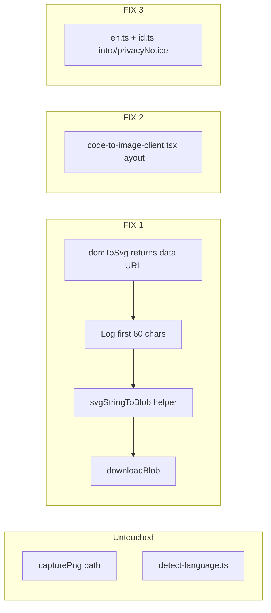

# Pre-merge Fixes — Code to Image

## Do NOT touch (verified working)

| Area | Files | Constraint |
|------|-------|------------|
| PNG capture | `src/app/(site)/tools/code-to-image/lib/export-image.ts` `capturePng`, `dataUrlToBlob` (PNG path), `ensureFontsLoaded` | No changes to PNG pipeline |
| Language detect/override | `src/app/(site)/tools/code-to-image/lib/detect-language.ts`, lang state/handlers in client | Leave logic and UI behavior alone |
| Shared components | `components/ui/*`, site footer, other tools | Out of scope |

---

## FIX 1 — SVG export broken (required)

### Root cause (verified in source)

`modern-screenshot` `domToSvg` (in `node_modules/modern-screenshot/dist/index.mjs`) does **not** return raw `<svg>` markup. It calls `svgToDataUrl()`, which returns:

```text
data:image/svg+xml;charset=utf-8,<url-encoded-xml>
```

Current `downloadSvg` in `src/app/(site)/tools/code-to-image/lib/export-image.ts` writes this string directly into a Blob — file starts with `data:` instead of `<`, causing **"Start tag expected, '<' not found"**.

### Fix (SVG path only in `export-image.ts`)

1. **Empirical log** in `captureSvg` (first ~60 chars of `domToSvg` return):

```typescript
const result = await domToSvg(node, { font: FONT_OPTIONS });
console.log("[code-to-image] domToSvg prefix:", result.slice(0, 60));
```

2. Add `svgStringToBlob(result: string): Blob` helper (new, SVG-only):

| Prefix | Action |
|--------|--------|
| `data:` | `await (await fetch(result)).blob()` — handles utf-8 encoded and base64 data URLs |
| `<` (trimmed) | `new Blob([result], { type: "image/svg+xml;charset=utf-8" })` |
| else | throw with clear error |

3. Change `captureSvg` return type: `Promise<Blob>` (not `string`).

4. Replace `downloadSvg(svg: string, ...)` with `downloadSvgBlob(blob: Blob, fileName)` or inline `downloadBlob(blob, fileName)` in client.

5. Update `handleDownloadSvg` in `src/app/(site)/tools/code-to-image/code-to-image-client.tsx` to use blob download.

6. **Remove `console.log` after Vercel verification** confirms data URL prefix.

**Do not modify** `capturePng`, `dataUrlToBlob` PNG usage, or `FONT_OPTIONS` / `ensureFontsLoaded`.

### Verification

- Re-download `.svg` on Vercel preview → opens as valid image in browser
- PNG still shows Geist Mono (unchanged path)
- ContinueWith still works after PNG download

---

## FIX 2 — UI consistency (tool-local only)

Reference: `src/app/(site)/tools/html-to-markdown/html-to-markdown-client.tsx` (primary), `src/app/(site)/tools/compressor/compressor-client.tsx` (section rhythm).

All changes confined to `src/app/(site)/tools/code-to-image/code-to-image-client.tsx` only.

### Workspace grid

| Current | Target (match html-to-markdown) |
|---------|--------------------------------|
| Options label "Style" | Rename to **"Options"** |
| Two option cards (style + chrome) | **Single** options card: Language, Theme, Padding, Window chrome, Filename — same `p-3 rounded-xl bg-card border border-border/40` pattern |
| Textarea `h-[400px]` | `h-[450px]` |
| Preview `min-h-[400px]` | Fixed `relative w-full h-[514px]` wrapper |
| Export buttons below preview | Move **Download PNG / SVG / Copy** into preview **header row** (`h-8`, `size="sm"`, `h-8 px-3` — same as html-to-markdown Copy/Download) |
| Empty preview state | Dashed border card with uppercase title + helper text (match output-empty pattern) |
| `ContinueWith` | Stays below preview pane (after export header row + preview box) |

### Bottom sections — reorder and restyle

**New order** (match suite):

1. Workspace grid
2. `<PrivacyNotice>` (before educational sections)
3. How It Works
4. Use Cases
5. FAQ
6. Related Tools

**Section styling** (copy from html-to-markdown):

- **How It Works:** `max-w-5xl`, `h2` → `text-xl sm:text-2xl font-black`, 4-col `md:grid-cols-4`, cards `p-5 rounded-2xl shadow-sm`, watermark step numbers `01`–`04`
- **Use Cases:** titled cards (`Web Content Migration`-style hardcoded EN titles for the 4 cases), `md:grid-cols-2`, `shadow-sm`
- **FAQ:** `HelpCircle` icon + `text-xl sm:text-2xl` heading, `md:grid-cols-2` grid
- **Related Tools:** add `animate-fade-in` + `group` hover on cards (match html-to-markdown)

No shared component edits. If a mismatch requires changing `components/ui/*`, STOP and report.

---

## FIX 3 — Hero copy (light)

Files: `src/lib/i18n/dictionaries/en.ts` + `src/lib/i18n/dictionaries/id.ts` — `tools.code-to-image` only.

### `intro` (hero)

**Current ending:** `"...hand off to other image tools. Runs entirely in your browser."`

**Change:** Remove trailing browser clause from hero. Keep pure dev/aesthetics lead:

> "Turn your code into polished, share-ready images for Twitter, blogs, and docs — with developer-focused themes and crisp Geist Mono typography. Style your snippets, export PNG or SVG, and hand off to other image tools."

### `privacyNotice`

Tone down confidentiality framing. Factual, secondary:

**EN (proposed):** "Highlighting and image export run locally in your browser tab using Shiki and modern-screenshot."

**ID:** Matching placeholder tone (factual, not privacy headline).

Do not change global footer. Do not restructure other i18n keys.

---

## Post-fix verification

```bash
npm run build   # must pass clean
npm run lint    # no new issues
```

**Vercel preview checklist:**

- [ ] SVG downloads and opens as valid image
- [ ] PNG still shows Geist Mono
- [ ] ContinueWith → compressor hands off correctly
- [ ] UI feels native alongside html-to-markdown

**Deliverable:** Report preview URL after deploy (agent cannot generate Vercel URL without deployment access).

---

## Architecture (fix scope)



---

## Implementation Todos

| ID | Task | Status |
|----|------|--------|
| `fix1-svg` | Fix SVG export in export-image.ts: log domToSvg prefix, add svgStringToBlob, return Blob; update client handler; do not touch capturePng | Pending |
| `fix2-ui` | Align code-to-image-client.tsx layout/sections to html-to-markdown patterns (options card, preview header actions, section reorder/restyle) | Pending |
| `fix3-copy` | Lighten intro + privacyNotice in en.ts and id.ts (remove browser clause from hero) | Pending |
| `verify` | npm run build + lint; verify SVG/PNG/chaining on Vercel preview; report preview URL | Pending |