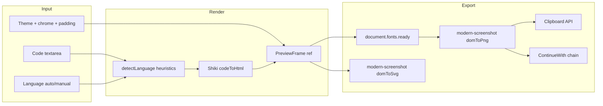

# Code to Image Tool — Audit & Implementation Plan

**Project:** Alatify-Jules  
**Tool route:** `/tools/code-to-image`  
**Branch:** `feat/code-to-image` (from updated `main`)  
**Date:** July 4, 2026  
**Status:** Plan approved — ready for implementation

---

## Executive Summary

This document records the pre-implementation codebase audit and the approved implementation plan for the **Code to Image** tool. The tool turns pasted source code into styled, share-ready PNG/SVG images entirely in the browser, using **Shiki** for syntax highlighting and **modern-screenshot** for DOM-to-image export. It wires into **Model A** tool chaining as a **source-only** node (hands off PNG to compressor, resizer, converter, watermark).

**Positioning:** Developer aesthetics and social sharing — not a privacy wedge. Factual "runs in your browser" notes are acceptable; they are not the headline.

---

## Audit Results

### Step 0 Prerequisites — Confirmed Complete

| Requirement | Status | Location |
|-------------|--------|----------|
| `shiki` ^4.3.1 installed | ✅ | `package.json` |
| `modern-screenshot` ^4.7.0 installed | ✅ | `package.json` |
| `transpilePackages` includes `shiki` | ✅ | `next.config.mjs` |
| `topLevelAwait: true` (webpack experiments) | ✅ | `next.config.mjs` |
| `asyncWebAssembly: true` | ✅ | `next.config.mjs` |
| Geist Mono site-wide | ✅ | `src/app/layout.tsx` + `tailwind.config.ts` (`font-mono`) |
| Shiki usage in `src/` | ❌ None (greenfield) | — |
| modern-screenshot usage in `src/` | ❌ None (greenfield) | — |
| Tool route `/tools/code-to-image` | ❌ Not created | — |
| Registry entry `code-to-image` | ❌ Not present | `src/lib/tools/registry.ts` (19 tools today) |
| Chain-map entry | ❌ Not present | `src/lib/chaining/chain-map.ts` |
| i18n keys `tools.code-to-image` | ❌ Not present | `en.ts` / `id.ts` |

**Conclusion:** Step 0 is complete on `main`. Implementation can proceed on `feat/code-to-image`.

---

### Codebase Patterns Audited

#### Tool page structure

All tools follow a server/client split:

- **`page.tsx`** — static `metadata`, inline JSON-LD (`WebApplication` + `BreadcrumbList`), client import
- **`{tool}-client.tsx`** — `"use client"`; all state, processing, UI
- Image tools (compressor, bg-remover) use `dynamic()` import to keep heavy WASM off SSR
- Document tools (html-to-markdown) use direct import — acceptable for lighter bundles

**Reference files:**
- `src/app/(site)/tools/compressor/page.tsx` — dynamic import pattern
- `src/app/(site)/tools/html-to-markdown/html-to-markdown-client.tsx` — text-tool UI shell, i18n sections, Related Tools

#### Registry (single source of truth)

- File: `src/lib/tools/registry.ts`
- Hub cards (`tools-client.tsx`) and sitemap derive automatically — **do not edit those files**
- `ToolEntry` shape: `id`, `name`, `route`, `category`, `description`, `keywords[]`
- Hub icon: `TOOL_ICONS[t.id] ?? FileText` fallback — no `tools-client.tsx` edit needed

#### Model A chaining

Chaining lives under `src/lib/chaining/` (not `src/lib/tools/`).

| Component | Path | Role |
|-----------|------|------|
| `CHAIN_MAP` | `src/lib/chaining/chain-map.ts` | Source tool → allowed downstream tool IDs |
| `WorkingImageProvider` | `src/lib/chaining/WorkingImageProvider.tsx` | In-memory blob handoff via React context |
| `ContinueWith` | `src/components/chaining/continue-with.tsx` | Source-side: `setWorkingImage` + `router.push` |
| `useHandoffInput` | `src/lib/chaining/useHandoffInput.ts` | Target-side: consume handoff once on mount |

**Existing chain sources (6 tools):**

```typescript
export const CHAIN_MAP: Record<string, string[]> = {
  "bg-remover":  ["compressor", "resizer", "watermark", "cropper", "converter"],
  "compressor":  ["resizer", "converter"],
  "resizer":     ["compressor", "cropper", "watermark", "converter"],
  "cropper":     ["compressor", "resizer", "watermark", "converter"],
  "watermark":   ["compressor", "converter"],
  "converter":   ["compressor", "resizer"],
};
```

**Source tool pattern (compressor example):**

```tsx
<ContinueWith
  currentToolId="compressor"
  outputBlob={compressedImage}
  outputFileName={fileName}
  provenance={provenance}
  onStartOver={clearActiveImage}
/>
```

**Provenance type** (no changes allowed to provider):

```typescript
type ImageSourceType = "user-upload" | "stock-unsplash" | "stock-pexels" | "stock-pixabay";

interface Provenance {
  sourceToolId: string;
  sourceType: ImageSourceType;
  aiProcessingBlocked: boolean;
}
```

For `code-to-image` (source only, no image input): use `sourceType: "user-upload"` as closest existing type. **Do not** use `useHandoffInput`.

#### i18n

- Canonical: `src/lib/i18n/dictionaries/en.ts`, `src/lib/i18n/dictionaries/id.ts`
- Hook: `useT()` — dot-path lookup with EN fallback
- Per-tool namespace: `tools.{tool-slug}` (kebab-case)
- Long-form prose only in i18n; tool name, buttons, SEO metadata stay English
- Standard sections: `intro`, `howItWorks.step1–4`, `useCases.case1–4`, `faq.q1–5` / `a1–5`, `privacyNotice`

#### Font setup (critical for export)

- `GeistMono` imported in `src/app/layout.tsx` as CSS variable
- Tailwind `font-mono` → `var(--font-geist-mono)`
- Watermark passes `GeistMono.style.fontFamily` to client for canvas — same pattern applicable here
- **#1 risk:** modern-screenshot DOM serialization may fall back to system fonts if Geist Mono is not embedded in capture

#### Shiki v4 bundling (audited in `node_modules/shiki`)

- Main export: `getSingletonHighlighter`, `createHighlighter`, `codeToHtml`
- Explicit lang imports: `shiki/langs/javascript`, etc. (re-exports `@shikijs/langs/*`)
- Explicit theme imports: `shiki/themes/github-dark`, etc.
- **Do not** use `new URL(..., import.meta.url)` for WASM paths
- **Do not** use `shiki/bundle/full` — explicit imports only to control bundle size

#### modern-screenshot (audited in `node_modules/modern-screenshot`)

- `domToPng(node, options)` → data URL string
- `domToSvg(node, options)` → SVG string
- Font embedding via `font: { preferredFormat: "woff2" }` option
- `document.fonts.ready` + `document.fonts.load()` before capture recommended

---

### Files Explicitly Off-Limits

| File | Reason |
|------|--------|
| `src/app/(site)/tools/tools-client.tsx` | Derives from registry |
| `src/lib/sitemap.ts` (or sitemap derivation) | Derives from registry |
| `next.config.mjs` | Owner handles Step 0 |
| Any unrelated tool | Additive-only scope |
| `WorkingImageProvider.tsx` | No new `ImageSourceType` without owner approval |

---

## Locked Technical Decisions

| Decision | Choice |
|----------|--------|
| Syntax highlighting | Shiki (async, WASM, bundled themes/langs) |
| Image rendering | modern-screenshot (`domToPng` / `domToSvg`) |
| Chaining | Model A — **source only** |
| Route | `/tools/code-to-image` |
| Registry category | `image` |
| State persistence | React state only — **no** localStorage/sessionStorage |

---

## Architecture



---

## Files to Create

### Tool route (new folder)

`src/app/(site)/tools/code-to-image/`

| File | Role |
|------|------|
| `page.tsx` | Server component: SEO `metadata`, JSON-LD, **dynamic** import of client (keeps Shiki/WASM off SSR bundle) |
| `code-to-image-client.tsx` | Main `"use client"` UI: state, controls, export actions, chaining |
| `lib/highlighter.ts` | Lazy Shiki singleton with **explicit** lang/theme imports only |
| `lib/detect-language.ts` | Heuristic auto-detect (Shiki has no general lang detector) |
| `lib/themes/geist-monokrom.ts` | Minimal custom monochrome Shiki theme |
| `lib/export-image.ts` | `domToPng` / `domToSvg` wrappers with font-embedding options |
| `components/preview-frame.tsx` | Themed capture `ref` container + optional window chrome |

### Files to Append (additive only)

| File | Change |
|------|--------|
| `src/lib/tools/registry.ts` | One new `ToolEntry` — `id: "code-to-image"`, `category: "image"`, `route: "/tools/code-to-image"`, EN+ID keywords |
| `src/lib/chaining/chain-map.ts` | `"code-to-image": ["compressor", "resizer", "converter", "watermark"]` |
| `src/lib/i18n/dictionaries/en.ts` | `tools["code-to-image"]` block |
| `src/lib/i18n/dictionaries/id.ts` | Matching ID keys (placeholder prose acceptable) |

---

## Feature Specification

### Input

- Textarea for pasted code (no file upload in v1)
- Language selector: **auto-detect** (heuristics) + **manual override** dropdown
- Curated languages: JS, TS, JSX/TSX (`tsx`), Python, HTML, CSS, JSON, Bash, Go, Rust, SQL, Markdown

### Styling controls

| Control | Options |
|---------|---------|
| Theme | 1) Geist monokrom (signature, custom Shiki theme + Geist Mono), 2) Dark (`github-dark`), 3) Light minimal (`github-light`) |
| Window chrome | Toggle — red/yellow/green traffic lights + optional editable filename label |
| Padding | Two presets: comfortable (32px) / compact (16px) |

### Output

- **Download PNG** (primary — chainable artifact)
- **Download SVG**
- **Copy to clipboard** (PNG blob; Sonner toast on failure)
- **Continue with →** (Model A chaining to compressor, resizer, converter, watermark)

---

## Shiki Integration (`lib/highlighter.ts`)

Client-only lazy init — no `import.meta.url` worker paths.

```typescript
import { getSingletonHighlighter } from "shiki";
import javascript from "shiki/langs/javascript";
import typescript from "shiki/langs/typescript";
import tsx from "shiki/langs/tsx";
import python from "shiki/langs/python";
import html from "shiki/langs/html";
import css from "shiki/langs/css";
import json from "shiki/langs/json";
import bash from "shiki/langs/bash";
import go from "shiki/langs/go";
import rust from "shiki/langs/rust";
import sql from "shiki/langs/sql";
import markdown from "shiki/langs/markdown";
import githubDark from "shiki/themes/github-dark";
import githubLight from "shiki/themes/github-light";
import geistMonokrom from "./themes/geist-monokrom";

// getSingletonHighlighter({ langs: [...], themes: [githubDark, githubLight, geistMonokrom] })
// highlight(code, lang, themeId) → codeToHtml
```

**Curated langs:** `javascript`, `typescript`, `tsx`, `python`, `html`, `css`, `json`, `bash`, `go`, `rust`, `sql`, `markdown`, plus `plaintext` fallback.

**Themes:**

1. **Geist monokrom** — custom: near-black bg (`#0a0a0a`), off-white fg (`#ededed`), subtle grayscale token variants
2. **Dark** — `github-dark`
3. **Light minimal** — `github-light`

Debounce highlight (~200ms) on code/lang/theme changes. Loading state while WASM initializes on first paste.

---

## Language Auto-Detect (`lib/detect-language.ts`)

Shiki does not auto-detect language. Lightweight heuristics for **Auto** mode; manual dropdown overrides and locks selection.

| Signal | Lang |
|--------|------|
| `#!/bin/bash`, `#!/usr/bin/env` | `bash` |
| `<!DOCTYPE`, `<html`, `<div` | `html` |
| Valid `JSON.parse` on trimmed input | `json` |
| `import React`, `export default function`, `<Component` | `tsx` |
| `interface `, `: string`, `as const` | `typescript` |
| `def `, `import `, `print(` | `python` |
| `fn main`, `let mut`, `impl ` | `rust` |
| `package main`, `func main` | `go` |
| `SELECT`, `INSERT`, `CREATE TABLE` | `sql` |
| Leading `# ` headings, fenced blocks | `markdown` |
| `{` + property selectors | `css` |
| Default | `javascript` |

UI: dropdown with **Auto** as default. When user picks manual, set `languageMode: "manual"` until they re-select Auto.

---

## Preview Frame + Window Chrome (`components/preview-frame.tsx`)

`forwardRef<HTMLDivElement>` container wrapping Shiki HTML:

- **Background + padding** — comfortable (32px) / compact (16px) outside `<pre>`
- **Font** — `style={{ fontFamily: GeistMono.style.fontFamily }}` on container and `pre`/`code` overrides
- **Window chrome** — traffic-light dots + editable filename (default `snippet.ts`)
- `dangerouslySetInnerHTML` for Shiki output; outer frame owns capture styling

---

## Export Pipeline (`lib/export-image.ts`)

**Primary risk: Geist Mono must embed in PNG on Vercel preview.**

```typescript
import { domToPng, domToSvg } from "modern-screenshot";

export async function capturePng(node: HTMLElement): Promise<Blob> {
  await document.fonts.ready;
  await document.fonts.load(`14px ${GeistMono.style.fontFamily}`);
  const dataUrl = await domToPng(node, {
    scale: 2,
    backgroundColor: null,
    font: { preferredFormat: "woff2" },
  });
  // dataUrl → Blob
}
```

- **PNG** — store `outputBlob` for download, clipboard, chaining
- **SVG** — `domToSvg` with same font options
- **Copy** — `navigator.clipboard.write([new ClipboardItem({ "image/png": blob })])`; `toast.error` on failure

Filename: `{editableName}.png`

**If fonts fall back on Vercel preview and cannot be embedded cleanly: STOP and report — do not ship degraded export.**

---

## Chaining (Model A — Source Only)

Match `continue-with.tsx` and compressor/bg-remover conventions exactly.

**In `code-to-image-client.tsx`:**

- **No** `useHandoffInput`
- Static provenance:

```typescript
const [provenance] = useState<Provenance>({
  sourceToolId: "code-to-image",
  sourceType: "user-upload",
  aiProcessingBlocked: false,
});
```

- After PNG capture:

```tsx
{outputBlob && (
  <ContinueWith
    currentToolId="code-to-image"
    outputBlob={outputBlob}
    outputFileName={fileName}
    provenance={provenance}
    onStartOver={handleReset}
  />
)}
```

**Append to `chain-map.ts`:**

```typescript
"code-to-image": ["compressor", "resizer", "converter", "watermark"],
```

---

## UI Layout (`code-to-image-client.tsx`)

Follow `html-to-markdown-client.tsx` shell:

1. `<main>` with decorative glows, `<Header showBackToTools />`
2. Hero badge + **h1 "Code to Image"** + `t("tools.code-to-image.intro")` — dev/aesthetics angle
3. Two-column workspace (stack on mobile):
   - **Left:** textarea, language, theme, chrome toggle, filename, padding
   - **Right:** live `PreviewFrame` + export buttons (PNG / SVG / Copy)
4. Bottom: How it works, Use cases, FAQ, Related Tools, `<PrivacyNotice>`
5. Sample code prefill (short TypeScript snippet)

---

## Registry Entry

Append to `src/lib/tools/registry.ts`:

```typescript
{
  id: "code-to-image",
  name: "Code to Image",
  route: "/tools/code-to-image",
  category: "image",
  description: "Turn code snippets into styled, share-ready PNG images for social posts.",
  keywords: [
    // EN
    "code to image", "code screenshot", "syntax highlight image", "code snippet image",
    "share code image", "dev twitter", "carbon alternative", "ray.so alternative",
    "code png", "syntax highlighting export", "programming screenshot",
    // ID
    "kode ke gambar", "screenshot kode", "cuplikan kode ke gambar",
    "syntax highlight", "gambar kode program", "export kode ke png",
  ],
}
```

---

## i18n Keys (`tools.code-to-image`)

Mirror `tools.html-to-markdown` structure in `en.ts` and `id.ts`:

| Key | Content guidance |
|-----|------------------|
| `intro` | Aesthetics-first: polished, share-ready images for social/docs |
| `howItWorks.step1–4` | Paste → highlight → style → export/chain |
| `useCases.case1–4` | Dev Twitter, blog posts, README visuals, conference slides |
| `faq.q1–5` / `a1–5` | Themes, languages, formats, clipboard, free/no-account |
| `privacyNotice` | Factual client-side note (secondary) |

Tool name, button labels, SEO metadata stay **English** in `page.tsx`.

---

## `page.tsx` Metadata

Follow `html-to-markdown/page.tsx`:

- Title: `"Free Code to Image — Syntax-Highlighted Snippets for Social | Alatify"`
- `applicationCategory: "DeveloperApplication"` in JSON-LD
- Dynamic import of client component

---

## Guardrails (Mandatory)

- **ADDITIVE ONLY** — no deletions or restructuring of existing files
- **No** `import.meta.url` for worker/wasm paths
- **No** localStorage / sessionStorage
- **No** edits to `tools-client.tsx`, `sitemap.ts`, `next.config.mjs`
- Run `npm run build` before declaring complete
- Verify on **Vercel preview** (not localhost): fonts, chaining, no WASM 404
- If production WASM 404 or unfixable font fallback: **STOP and report**

---

## Risk Mitigation

| Risk | Mitigation |
|------|------------|
| Font fallback in export | `document.fonts.load` + `font: { preferredFormat: "woff2" }` + explicit `GeistMono.style.fontFamily`; verify on Vercel |
| Shiki WASM 404 in prod | Rely on owner's `next.config.mjs`; if 404 persists, STOP and report |
| Large bundle | Explicit lang imports only (12 langs, 2 bundled + 1 custom theme) — avoid `shiki/bundle/full` |
| SSR crash | `"use client"` + dynamic page import; highlighter init only in `useEffect` |

---

## Definition of Done

- [ ] `/tools/code-to-image` live on branch; hub card appears via registry (no `tools-client.tsx` edit)
- [ ] Paste code → auto-detect works; manual override works
- [ ] All 3 themes render; window-chrome toggle works on any theme
- [ ] PNG export shows Geist Mono correctly (verified on Vercel preview)
- [ ] SVG export and copy-to-clipboard work
- [ ] "Continue with →" hands PNG to compressor/resizer/converter/watermark via Model A
- [ ] EN + ID i18n keys present
- [ ] `npm run build` passes clean
- [ ] Verified on Vercel preview: fonts, chaining, no production WASM 404

---

## Implementation Todos

| ID | Task | Status |
|----|------|--------|
| `branch-setup` | Confirm Step 0 on main, create `feat/code-to-image` branch | Pending |
| `shiki-lib` | Create `lib/highlighter.ts`, `geist-monokrom` theme, `detect-language.ts` | Pending |
| `preview-export` | Build `PreviewFrame` + `export-image.ts` (font embedding) | Pending |
| `client-ui` | Implement `code-to-image-client.tsx` (controls, preview, export, sections) | Pending |
| `page-metadata` | Create `page.tsx` with SEO metadata, JSON-LD, dynamic import | Pending |
| `registry-chain` | Append registry entry + chain-map source registration | Pending |
| `i18n` | Add `tools.code-to-image` keys to `en.ts` and `id.ts` | Pending |
| `verify` | `npm run build`; verify fonts/chaining/WASM on Vercel preview | Pending |

---

## Verification Checklist

| Step | Action |
|------|--------|
| Build | `npm run build` — clean ESLint (no unused imports, no `any`, `const` over `let`) |
| WASM | Vercel preview Network tab — no 404 on Shiki `onig.wasm` |
| Fonts | Export PNG on Vercel preview — confirm Geist Mono, not system fallback |
| Chaining | Generate PNG → "Continue with Compressor →" → image loads in compressor |
| Features | Auto-detect, manual override, 3 themes, chrome toggle, PNG/SVG/copy |
| i18n | EN + ID keys under `tools.code-to-image` |