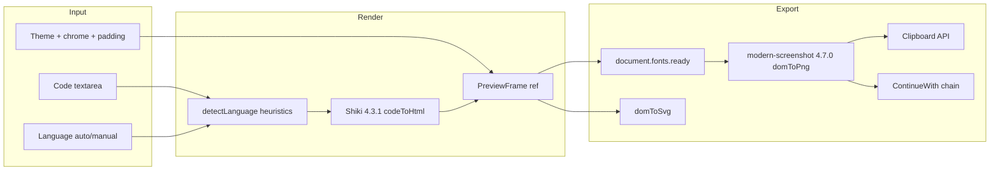

# Code to Image — Corrected Plan (Verified)

## Verification Report (empirical, from this repo)

### 1. Shiki version — verified

```bash
npm ls shiki
# alatify@0.1.0
# └── shiki@4.3.1
```

Also confirmed in [`node_modules/shiki/package.json`](node_modules/shiki/package.json): `"version": "4.3.1"`.

**Clarification on versioning:** Shiki **is** at package version 4.3.1 in this repo. The API names (`getSingletonHighlighter`, `createHighlighter`, `codeToHtml`, `shiki/langs/*`, `shiki/themes/*`) are the **current** API for this installed version — confirmed in [`node_modules/shiki/dist/index.d.mts`](node_modules/shiki/dist/index.d.mts). This is the post-rewrite Shiki architecture (sometimes called "v1 API" in docs); the **npm package version** is 4.3.1, not 1.x.

The plan is aligned to **shiki@4.3.1** as installed. No API changes needed.

### 2. Plaintext language — corrected

**Problem in prior plan:** Listed `plaintext` as a loaded lang alongside imports, but never imported it — inconsistent.

**Empirical finding:** In shiki@4.3.1, `plaintext`, `text`, `txt`, and `plain` are **special-handled languages** built into `@shikijs/primitive` via `isPlainLang()`. They do **not** require a grammar import and do **not** throw when used.

From [`node_modules/@shikijs/primitive/dist/index.mjs`](node_modules/@shikijs/primitive/dist/index.mjs):

```javascript
// Hard-coded plain text languages: plaintext, txt, text, plain
function isPlainLang(lang) {
  return !lang || ["plaintext", "txt", "text", "plain"].includes(lang);
}
```

**Corrected approach:**

| Scenario | Lang ID passed to `codeToHtml` | Import required? |
|----------|-------------------------------|------------------|
| Auto-detect default (unrecognized code) | `javascript` | Yes — `shiki/langs/javascript` |
| User selects "Plain text" in dropdown | `text` (or `plaintext`) | **No** — special-handled |
| All other manual selections | matching curated lang | Yes — explicit import |

**Lang imports in `lib/highlighter.ts` (13 grammars):**
`javascript`, `typescript`, `tsx`, `python`, `html`, `css`, `json`, `bash`, `go`, `rust`, `sql`, `markdown`

**Not imported:** `plaintext` / `text` — use as special lang IDs only.

**Dropdown options:** Auto, Plain text (`text`), JavaScript, TypeScript, JSX/TSX, Python, HTML, CSS, JSON, Bash, Go, Rust, SQL, Markdown.

### 3. modern-screenshot font option — confirmed

```bash
npm ls modern-screenshot
# └── modern-screenshot@4.7.0
```

From [`node_modules/modern-screenshot/dist/index.d.ts`](node_modules/modern-screenshot/dist/index.d.ts) lines 105–118:

```typescript
font?: false | {
  minify?: (font: ArrayBuffer, subset: string) => ArrayBuffer;
  preferredFormat?: 'woff' | 'woff2' | 'truetype' | 'opentype' | 'embedded-opentype' | 'svg' | string;
  cssText?: string;
};
```

**`font.preferredFormat: "woff2"` is correct** for modern-screenshot@4.7.0. Passing any object to `font` enables embedding; `font: false` disables it.

**Keep regardless:** `await document.fonts.ready` and `await document.fonts.load(...)` before capture.

---

## Architecture (unchanged)



---

## Shiki Integration (`lib/highlighter.ts`) — corrected

Target: **shiki@4.3.1**

**Initialization pattern (approved refinement):** Do **not** use module-level top-level `await`. Initialize the highlighter lazily inside a client-side async function, called on first use (first paste or first highlight request). This keeps WASM off the initial module load so it does not affect TBT/interactivity on the tool page.

```typescript
import { getSingletonHighlighter, type Highlighter } from "shiki";
import javascript from "shiki/langs/javascript";
import typescript from "shiki/langs/typescript";
import tsx from "shiki/langs/tsx";
import python from "shiki/langs/python";
import html from "shiki/langs/html";
import css from "shiki/langs/css";
import json from "shiki/langs/json";
import bash from "shiki/langs/bash";
import go from "shiki/langs/go";
import rust from "shiki/langs/rust";
import sql from "shiki/langs/sql";
import markdown from "shiki/langs/markdown";
import githubDark from "shiki/themes/github-dark";
import githubLight from "shiki/themes/github-light";
import geistMonokrom from "./themes/geist-monokrom";

let highlighterPromise: Promise<Highlighter> | null = null;

function getHighlighter(): Promise<Highlighter> {
  if (!highlighterPromise) {
    highlighterPromise = getSingletonHighlighter({
      langs: [javascript, typescript, tsx, python, html, css, json, bash, go, rust, sql, markdown],
      themes: [geistMonokrom, githubDark, githubLight],
    });
  }
  return highlighterPromise;
}

export async function highlightCode(code: string, lang: string, theme: string): Promise<string> {
  const highlighter = await getHighlighter();
  return highlighter.codeToHtml(code, { lang, theme });
  // For plain text: lang = "text" (no import, no loadLanguage call)
}
```

- **No** module-level top-level `await` — WASM loads only when `highlightCode()` is first called
- Client-only; no `import.meta.url` WASM paths
- `code-to-image-client.tsx` calls `highlightCode()` from debounced effect/handler on first paste
- Show loading state while `getHighlighter()` promise resolves on first use
- Debounce highlight ~200ms after highlighter is ready

---

## Export Pipeline (`lib/export-image.ts`) — confirmed

Target: **modern-screenshot@4.7.0**

```typescript
import { domToPng, domToSvg } from "modern-screenshot";

export async function capturePng(node: HTMLElement): Promise<Blob> {
  await document.fonts.ready;
  await document.fonts.load(`14px ${GeistMono.style.fontFamily}`);
  const dataUrl = await domToPng(node, {
    scale: 2,
    backgroundColor: null,
    font: { preferredFormat: "woff2" },
  });
  // dataUrl → Blob
}
```

Same `font` option for `domToSvg`. If Geist Mono falls back on Vercel preview: **STOP and report**.

---

## Files to Create / Append (unchanged scope)

**Create:** [`src/app/(site)/tools/code-to-image/`](src/app/(site)/tools/code-to-image/) — `page.tsx`, `code-to-image-client.tsx`, `lib/highlighter.ts`, `lib/detect-language.ts`, `lib/themes/geist-monokrom.ts`, `lib/export-image.ts`, `components/preview-frame.tsx`

**Append only:**
- [`src/lib/tools/registry.ts`](src/lib/tools/registry.ts) — `code-to-image` entry, category `image`
- [`src/lib/chaining/chain-map.ts`](src/lib/chaining/chain-map.ts) — `"code-to-image": ["compressor", "resizer", "converter", "watermark"]`
- [`src/lib/i18n/dictionaries/en.ts`](src/lib/i18n/dictionaries/en.ts) + [`id.ts`](src/lib/i18n/dictionaries/id.ts)

**Do NOT touch:** `tools-client.tsx`, `sitemap.ts`, `next.config.mjs`, unrelated tools.

---

## Chaining, UI, i18n, guardrails

Unchanged from approved plan:
- Model A **source only** — `ContinueWith`, no `useHandoffInput`
- Provenance: `{ sourceToolId: "code-to-image", sourceType: "user-upload", aiProcessingBlocked: false }`
- 3 themes (Geist monokrom custom, github-dark, github-light)
- Window chrome toggle, padding presets, PNG/SVG/copy export
- Aesthetics-first copy; no privacy wedge headline
- `npm run build` + Vercel preview verification (fonts, chaining, WASM)
- Highlighter: lazy async init on first use — **no** module-level top-level `await`

---

## Risk Mitigation

| Risk | Mitigation |
|------|------------|
| Font fallback in export | `document.fonts.load` + `font: { preferredFormat: "woff2" }` + explicit `GeistMono.style.fontFamily`; verify on Vercel |
| Shiki WASM 404 in prod | Rely on owner's `next.config.mjs`; if 404 persists, STOP and report |
| Large bundle | Explicit lang imports only (13 langs, 2 bundled + 1 custom theme) — avoid `shiki/bundle/full` |
| SSR crash | `"use client"` + dynamic page import; highlighter via lazy async function on first use |
| TBT / interactivity | Lazy `getHighlighter()` defers WASM until first `highlightCode()` call; no top-level await in `highlighter.ts` |

---

## Definition of Done (unchanged)

- `/tools/code-to-image` live; hub card via registry
- Auto-detect + manual override (including Plain text via special lang `text`)
- 3 themes + chrome toggle
- PNG shows Geist Mono on Vercel preview
- SVG + clipboard work
- Continue with → compressor/resizer/converter/watermark
- EN + ID i18n keys
- `npm run build` clean
- No production WASM 404

---

## Implementation Todos

| ID | Task | Status |
|----|------|--------|
| `branch-setup` | Confirm shiki@4.3.1 on main, create feat/code-to-image branch | Pending |
| `shiki-lib` | Create highlighter.ts with lazy `getHighlighter()` on first use (no module-level top-level await), geist-monokrom theme, detect-language.ts | Pending |
| `preview-export` | Build PreviewFrame + export-image.ts with font.preferredFormat woff2 (modern-screenshot@4.7.0) | Pending |
| `client-ui` | Implement code-to-image-client.tsx with Plain text dropdown option using lang id text | Pending |
| `page-metadata` | Create page.tsx with SEO metadata, JSON-LD, dynamic client import | Pending |
| `registry-chain` | Append registry entry + chain-map source registration | Pending |
| `i18n` | Add tools.code-to-image keys to en.ts and id.ts | Pending |
| `verify` | npm run build; verify fonts/chaining/WASM on Vercel preview | Pending |